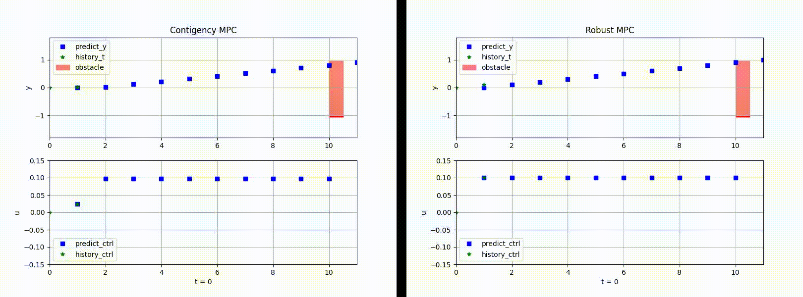

# Contingency-MPC
Contingency Model Predictive Control for Linear Time-Varying Systems

## Contigency MPC VS Robust MPC

## Reference
Alsterda, John P., and J. Christian Gerdes. "Contingency model predictive control for linear time-varying systems." arXiv preprint arXiv:2102.12045 (2021).
